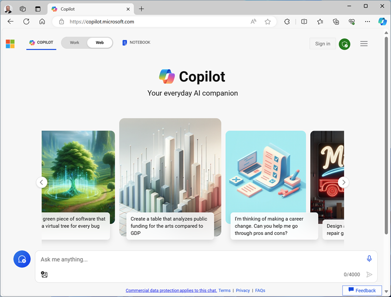

---
lab:
  title: Übungstitel
  module: Learn module title
---
<!--
Edit the metadata above to manage the list of exercises in the home page of the GitHub site that gets generated.
You can delete the module and edit index.md in the root of the repo to customize the display so that only the exercises are listed
To enable GitHub page publishing, edit the Page settings for the repo and publish from the main branch
-->

# Übungstitel <!-- match title in metadata above (and Learn Exercise unit and ILT slide)-->

In dieser Übung: <!-- provide a description of what they'll do and why it;s important -->

Diese Übung sollte in etwa **XX** Minuten abgeschlossen sein. <!-- update with estimated duration -->

## Vor der Installation

<!--
Add steps to get the learner to the starting point" for the exercise.
This might be cloning the repo and running a script or performing some manual steps.
Only include this section if its necessary to do some pre-exercise setup AND the same setup steps are required for self-paced (on Learn) and managed (in hosted ILT lab profiles) scenarios. Otherwise delete this section.
If self-paced /ILT-specific setup steps are required, include them in the Learn "Exercise" unit from where they open this exercise and in the Skillable lab profile instructions before this markdown file is imported.
 -->

Bevor Sie mit dieser Übung starten können, müssen Sie...

1. 1. Schritt
1. Step 2
1. usw.

## Aufgabe <!-- Change to an appropriate task title with an imperative verb phrase (e.g. "Do something") -->

Zunächst müssen Sie ...

1. Schritt 1
1. Dieser Schritt enthält ein Beispiel für `inline code formatting`, das verwendet wird, wenn der Lernende etwas (irgendetwas, nicht nur Code) tippen muss, weil es einen [T]-Link in der gehosteten Skillable-Umgebung erzeugt.
1. Wenn die Lernenden eine Webseite öffnen sollen, fügen Sie sowohl einen Link (zum Öffnen durch Anklicken auf der HTML-GitHub-Seite) als auch die als Code formatierte URL (zum Eingeben in einem gehosteten VM-Browser) ein. Zum Beispiel: „Öffnen Sie die [Bing](https://www.bing.com) Webseite unter `https://www.bing.com`“.
1. Wenn Sie den Lernenden benötigen, um eine Datei (oder mehrere Dateien in einer Zip-Datei) herunterzuladen, speichern Sie die Datei im Ordner „Allfiles“ in diesem Repo und verwenden Sie die **raw** URL - etwa so: „Download [Dateiname](https://raw.githubusercontent.com/MicrosoftLearning/INF99X-SampleCourse/master/Allfiles/Labs/01/Starter/azuredeploy.json) von `https://raw.githubusercontent.com/MicrosoftLearning/INF99X-SampleCourse/master/Allfiles/Labs/01/Starter/azuredeploy.json`.
1. Alternativ können Sie für eine Entwicklergruppe dieses Repository klonen lassen, wenn dies besser geeignet erscheint.
1. Wenn Sie einen mehrzeiligen Codeblock einfügen müssen, rücken Sie ihn so ein, dass er mit dem Einzug der Aufzählungsliste übereinstimmt:

    ```python
    # This is an example of an
    # indented code block.
    ```

1. Wenn Sie einen Screenshot einfügen müssen, passen Sie ihn auf eine angemessene Größe an (so dass jeder „normal“ formatierte Text in einem Teil-Screenshot ungefähr die gleiche Größe hat wie dieser Text - versuchen Sie im Allgemeinen, Screenshots von vollständigen Anwendungsfenstern mit einer Größe von ca. 800x600 Pixel zu erstellen). Speichern Sie Bilder in einem Unterordner **Media** und fügen Sie sie mithilfe von Markdown zur Seite hinzu (beachten Sie dabei die Groß- und Kleinschreibung von Datei- und Ordnernamen). Wenn das Bild in einer Liste steht, rücken Sie es ein, etwa so:

     

1. Wenn Sie erklären müssen, warum etwas auf eine bestimmte Art und Weise gemacht wird, oder zusätzlichen Kontext oder Links zu Informationen bereitstellen möchten, verwenden Sie eine Notiz wie diese:

    > **Hinweis**: Dies ist ein Hinweis.

1. Seien Sie flexibel, wenn Sie Anleitungen bereitstellen, die sich zwischen Übungsumgebungen mit Selbststudium und gehosteten Übungen unterscheiden können. Zum Beispiel:
    - „Melden Sie sich mithilfe Ihrer Azure-Anmeldeinformationen an“ (unter der Annahme, dass es lernspezifische Anweisungen zur Verwendung eines persönlichen Abonnements oder zur Erstellung einer Testversion auf der Übungsseite ‚Lernen‘ und ILT-spezifische Anweisungen zur Verwendung der bereitgestellten Cloudslice-Anmeldeinformationen im Skillable-Übungsprofil gab)
    - „Wählen Sie eine bestehende Ressourcengruppe aus oder erstellen Sie eine neue“ (unter der Annahme, dass Sie bei Verwendung einer Skillable CS-R Cloudslice im Übungsprofil beachtet haben, welche Ressourcengruppe Lernende verwenden sollen)
    <!-- The key point is that this markdown file should be environment-agnostic - you need to provide explicit details of things that can vary OUTSIDE of this file (in the Learn exercise page or the Skillable lab profile instructions) -->
1. usw.

## Nächste Aufgabe

Und jetzt, ...

1. 1. Schritt
1. Step 2
1. usw.

## Aufgabe mit Unteraufgaben

Manchmal möchten Sie einen Taak in kleinere Blöcke unterteilen.

### Unteraufgabe 1

1. 1. Schritt
1. Step 2
1. usw.

### Unteraufgabe 2

1. 1. Schritt
1. Step 2
1. usw.

## Bereinigung

<!-- Good practice - especially as self-paced learners will be using their own subscriptions -->
<!-- Delete this section if it is not needed -->

Nachdem Sie die Übung beendet haben, sollten Sie die von Ihnen erstellten Cloud-Ressourcen löschen, um eine unnötige Ressourcennutzung zu vermeiden.

1. Schritt 1
2. usw.
